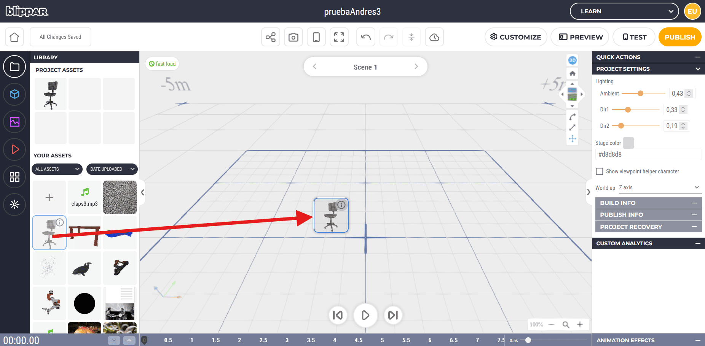
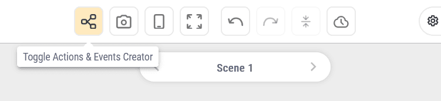
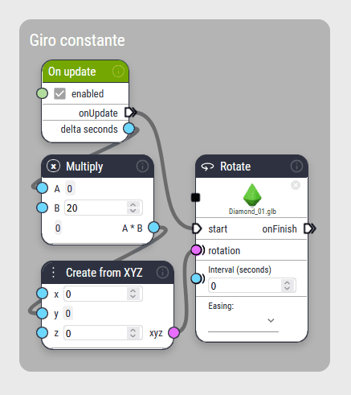
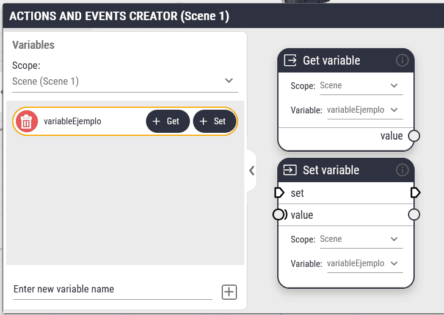

# Guía de uso de BlippAR
repositorio para el uso de BlippAR


## ¿Qué se puede hacer con BlippAR?


## Primeros pasos


### Tipos de proyectos


### Interfaz





## Acciones y eventos

Una herramienta que potencia los proyectos de blippAR es el ***Actions and Events Creator*** 




### Nodos de ejemplo

A continuación hay una serie de eventos desarrolladas para uso libre, para ello se tiene que copiar el texto json correspondiente, y pegarlo en la pestaña de acciones y eventos de la escena en la que se quiera usar.

|Cambiar escena|Cambiar escena después esperar|
---|---
|||

#### Cambio de escena
Este flujo produce un cambio de escena luego de pulsar un objeto. Para esto se usa el nodo `On tap` y se conecta a `Go to scene`, este comportamiento se puede ligar a otras acciones, como un movimiento, un cambio de color, etc.
```json
{"type":"graph-data","center":{"x":588.3497055380036,"y":1035.8942415222284},"bounds":{"x":496,"y":848,"w":289,"h":147},"nodeData":{"958":{"id":958,"data":{"enabled":true,"objIn":["hX84ZAEXqSwRikXSN3Pwy8"]},"inputs":{"objIn":{"connections":[]},"enabled":{"connections":[]}},"outputs":{"objOut":{"connections":[]},"onTap":{"connections":[{"node":959,"input":"goToScene","data":{"pins":[]}}]}},"position":[496,848],"name":"OnTap"},"959":{"id":959,"data":{"sceneIn":["2aqJjcxVF493KszbrpjR15"]},"inputs":{"goToScene":{"connections":[{"node":958,"output":"onTap","data":{"pins":[]}}]}},"outputs":{},"position":[656,864],"name":"GoToScene"}}}
```

#### Cambio de escena después de un tiempo
Este produce un cambio de escena luego del paso de 10 segundos desde el inicio de la escena. Comienza con el nodo `On scene start` (que se acciona el momento en que la escena inicia) y se conecta a `Branch` (que se usa para activar o desactivar el flujo entre 2 desviaciones), luego se conecta a un nodo `Wait`(que pausa el flujo por un tiempo determinado), y finaliza en `Go to scene`.
```json
{"type":"graph-data","center":{"x":588.3497055380036,"y":1035.8942415222284},"bounds":{"x":496,"y":1120,"w":689,"h":191},"nodeData":{"995":{"id":995,"data":{},"inputs":{},"outputs":{"onSceneStart":{"connections":[{"node":1005,"input":"trigger","data":{"pins":[]}}]}},"position":[496,1120],"name":"OnSceneStart"},"996":{"id":996,"data":{"interval":10},"inputs":{"wait":{"connections":[{"node":1005,"output":"onTrue","data":{"pins":[]}}]},"interval":{"connections":[]}},"outputs":{"onWait":{"connections":[{"node":997,"input":"goToScene","data":{"pins":[]}}]}},"position":[864,1120],"name":"Wait"},"997":{"id":997,"data":{"sceneIn":["2aqJjcxVF493KszbrpjR15"]},"inputs":{"goToScene":{"connections":[{"node":996,"output":"onWait","data":{"pins":[]}}]}},"outputs":{},"position":[1056,1120],"name":"GoToScene"},"1005":{"id":1005,"data":{"value":true},"inputs":{"trigger":{"connections":[{"node":995,"output":"onSceneStart","data":{"pins":[]}}]},"value":{"connections":[]}},"outputs":{"onTrue":{"connections":[{"node":996,"input":"wait","data":{"pins":[]}}]},"onFalse":{"connections":[]}},"position":[704,1168],"name":"Branch"}}}
```

|Accionar audio|Evento cíclico|Rotación constante|
---|---|---
||||

#### Accionar audio
Este flujo le da *play* a un audio luego de pulsar sobre un objeto. Para ello se usa un nodo `On tap` y se conecta a `Audio controller` (que controla un clip de audio asociado a un objeto de la escena).
```json
{"type":"graph-data","center":{"x":588.3497055380036,"y":1035.8942415222284},"bounds":{"x":32,"y":848,"w":342,"h":284},"nodeData":{"924":{"id":924,"data":{"position":[218.73096005561365,851.8799353820514],"objIn":["izftGdKhTpAaETcNfTSvaB"],"enabled":true},"inputs":{"objIn":{"connections":[]},"enabled":{"connections":[]}},"outputs":{"objOut":{"connections":[{"node":925,"input":"objIn","data":{"pins":[]}}]},"onTap":{"connections":[{"node":925,"input":"play","data":{"pins":[]}}]}},"position":[32,848],"name":"OnTap"},"925":{"id":925,"data":{"objIn":"izftGdKhTpAaETcNfTSvaB","volume":50,"audioIn":"10da1bea-6bc8-11f0-9ca1-06741fde3ecf","params":{"fullName":"4866737.claps3.mp3","name":"claps3.mp3","refId":"4866737","thumbSrc":"https://html.blippar.com/medias/export/128/353350"}},"inputs":{"objIn":{"connections":[{"node":924,"output":"objOut","data":{"pins":[]}}]},"audioIn":{"connections":[]},"play":{"connections":[{"node":924,"output":"onTap","data":{"pins":[]}}]},"pause":{"connections":[]},"stop":{"connections":[]},"volume":{"connections":[]},"loop":{"connections":[]}},"outputs":{"onPlay":{"connections":[]},"onPause":{"connections":[]},"onStop":{"connections":[]},"onLoop":{"connections":[]},"onFinish":{"connections":[]}},"position":[208,848],"name":"Audio"}}}
```

#### Evento cíclico
Este flujo hace que un objeto de la escena rote 360 grados durante medio segundo cada 3 segundos desde el inicio de la escena. Para eso parte en un `On scene start` y se conecta a un `Event connector` (que permite tener mayor orden de los nodos en la mesa de trabajo), luego se conecta a un nodo `Wait` que indica cada cuanto tiempo es la repetición, y este se conecta de vuelta al `Event connector`(esto produce una repetición), y a un nodo `Rotate` este realiza una rotación en [x,y,z] respecto a la orientación del objeto en un tiempo y un tipo de interpolación específico.
```json
{"type":"graph-data","center":{"x":823.6685754106409,"y":1471.8594330809192},"bounds":{"x":464,"y":1440,"w":585,"h":285},"nodeData":{"999":{"id":999,"data":{},"inputs":{},"outputs":{"onSceneStart":{"connections":[{"node":1088,"input":"trigger","data":{"pins":[]}}]}},"position":[464,1600],"name":"OnSceneStart"},"1000":{"id":1000,"data":{"interval":3},"inputs":{"wait":{"connections":[{"node":1088,"output":"onTrigger","data":{"pins":[]}}]},"interval":{"connections":[]}},"outputs":{"onWait":{"connections":[{"node":1046,"input":"start","data":{"pins":[]}},{"node":1088,"input":"trigger","data":{"pins":[]}}]}},"position":[688,1600],"name":"Wait"},"1046":{"id":1046,"data":{"interval":0.5,"rotation":[0,360,0],"objIn":["d5o6K726xjRyLBpStFhuDp"],"easing":"easeInOutQuad"},"inputs":{"objIn":{"connections":[]},"start":{"connections":[{"node":1000,"output":"onWait","data":{"pins":[]}}]},"rotation":{"connections":[]},"interval":{"connections":[]}},"outputs":{"onFinish":{"connections":[]}},"position":[896,1440],"name":"Rotate"},"1088":{"id":1088,"data":{},"inputs":{"trigger":{"connections":[{"node":999,"output":"onSceneStart","data":{"pins":[]}},{"node":1000,"output":"onWait","data":{"pins":[]}}]}},"outputs":{"onTrigger":{"connections":[{"node":1000,"input":"wait","data":{"pins":[]}}]}},"position":[672,1488],"name":"CombineEvents"}}}
```

#### Rotación constante
Este flujo produce un cambio en la rotación de un objeto de manera constante. Para ello se usa el nodo `On update` (que se ejecuta en cada fotograma), y se conecta por el lado del evento a un nodo `Rotate`, y por el lado del valor numérico (el punto azul) a un nodo `Multiply` (esta parte lo que hace es multiplicar la duración del fotograma por la velocidad, esto produce un giro consistente), luego se conacta a un `Create from XYZ` esto genera un vector a partir de 3 valores numéricos asociados a cada eje cartesiano, luego este se conecta al nodo `Rotate` antes mencionado, es importante que el valor de *Interval(seconds)* sea **0**.
```json
{"type":"graph-data","center":{"x":325.4978726986495,"y":1054.7862917632817},"bounds":{"x":-432,"y":848,"w":361,"h":392},"nodeData":{"771":{"id":771,"data":{"interval":0,"rotation":0,"objIn":["hX84ZAEXqSwRikXSN3Pwy8"]},"inputs":{"objIn":{"connections":[]},"start":{"connections":[{"node":776,"output":"onUpdate","data":{"pins":[]}}]},"rotation":{"connections":[{"node":772,"output":"xyzOut","data":{"pins":[]}}]},"interval":{"connections":[]}},"outputs":{"onFinish":{"connections":[]}},"position":[-224,976],"name":"Rotate"},"772":{"id":772,"data":{"x":0,"y":0,"z":0},"inputs":{"x":{"connections":[]},"y":{"connections":[{"node":774,"output":"result","data":{"pins":[]}}]},"z":{"connections":[]}},"outputs":{"xyzOut":{"connections":[{"node":771,"input":"rotation","data":{"pins":[]}}]}},"position":[-432,1120],"name":"Vector3"},"774":{"id":774,"data":{"valueA":0,"valueB":20,"result":0},"inputs":{"valueA":{"connections":[{"node":776,"output":"dt","data":{"pins":[]}}]},"valueB":{"connections":[]}},"outputs":{"result":{"connections":[{"node":772,"input":"y","data":{"pins":[]}}]}},"position":[-432,976],"name":"Multiply"},"776":{"id":776,"data":{"enabled":true,"dt":0},"inputs":{"enabled":{"connections":[]}},"outputs":{"onUpdate":{"connections":[{"node":771,"input":"start","data":{"pins":[]}}]},"dt":{"connections":[{"node":774,"input":"valueA","data":{"pins":[]}}]}},"position":[-432,848],"name":"OnUpdate"}}}
```

|Animación compleja|
|---|
||

#### Animación compleja
```json
{"type":"graph-data","center":{"x":50.30770952154537,"y":2448.1348493559954},"bounds":{"x":-432,"y":1376,"w":681,"h":1421},"nodeData":{"777":{"id":777,"data":{"interval":0.6,"rotation":[0,380,0],"easing":"easeOutQuad","objIn":["izftGdKhTpAaETcNfTSvaB"]},"inputs":{"objIn":{"connections":[]},"start":{"connections":[{"node":785,"output":"onFinish","data":{"pins":[]}}]},"rotation":{"connections":[]},"interval":{"connections":[]}},"outputs":{"onFinish":{"connections":[]}},"position":[-176,1568],"name":"Rotate"},"778":{"id":778,"data":{"enabled":true,"objIn":["izftGdKhTpAaETcNfTSvaB"]},"inputs":{"objIn":{"connections":[]},"enabled":{"connections":[]}},"outputs":{"objOut":{"connections":[]},"onTap":{"connections":[{"node":785,"input":"start","data":{"pins":[]}}]}},"position":[-432,1376],"name":"OnTap"},"780":{"id":780,"data":{"interval":0.6,"rotation":[0,750,0],"objIn":["hX84ZAEXqSwRikXSN3Pwy8"],"easing":"easeOutQuad"},"inputs":{"objIn":{"connections":[]},"start":{"connections":[{"node":789,"output":"onFinish","data":{"pins":[]}}]},"rotation":{"connections":[]},"interval":{"connections":[]}},"outputs":{"onFinish":{"connections":[]}},"position":[16,2208],"name":"Rotate"},"785":{"id":785,"data":{"interval":0.2,"rotation":[0,-20,0],"easing":"easeInQuad","objIn":["izftGdKhTpAaETcNfTSvaB"]},"inputs":{"objIn":{"connections":[]},"start":{"connections":[{"node":778,"output":"onTap","data":{"pins":[]}}]},"rotation":{"connections":[]},"interval":{"connections":[]}},"outputs":{"onFinish":{"connections":[{"node":777,"input":"start","data":{"pins":[]}},{"node":892,"input":"trigger","data":{"pins":[]}}]}},"position":[-432,1568],"name":"Rotate"},"789":{"id":789,"data":{"interval":0.2,"rotation":[0,-30,0],"objIn":["hX84ZAEXqSwRikXSN3Pwy8"],"easing":"easeInQuad"},"inputs":{"objIn":{"connections":[]},"start":{"connections":[{"node":892,"output":"onTrigger","data":{"pins":[]}}]},"rotation":{"connections":[]},"interval":{"connections":[]}},"outputs":{"onFinish":{"connections":[{"node":780,"input":"start","data":{"pins":[]}},{"node":794,"input":"start","data":{"pins":[]}}]}},"position":[-256,2208],"name":"Rotate"},"794":{"id":794,"data":{"objIn":"hX84ZAEXqSwRikXSN3Pwy8","interval":0.3,"scale":[44,38,44],"easing":"easeOutQuad"},"inputs":{"objIn":{"connections":[]},"start":{"connections":[{"node":789,"output":"onFinish","data":{"pins":[]}}]},"scale":{"connections":[]},"interval":{"connections":[]}},"outputs":{"onFinish":{"connections":[{"node":795,"input":"start","data":{"pins":[]}}]}},"position":[-80,2512],"name":"ScaleTo"},"795":{"id":795,"data":{"objIn":"hX84ZAEXqSwRikXSN3Pwy8","interval":0.3,"scale":[40,40,40],"easing":"easeOutQuad"},"inputs":{"objIn":{"connections":[]},"start":{"connections":[{"node":794,"output":"onFinish","data":{"pins":[]}}]},"scale":{"connections":[]},"interval":{"connections":[]}},"outputs":{"onFinish":{"connections":[]}},"position":[96,2512],"name":"ScaleTo"},"855":{"id":855,"data":{"objIn":"hX84ZAEXqSwRikXSN3Pwy8","interval":0.2,"delta":[0,0,-5],"easing":"easeInQuad"},"inputs":{"objIn":{"connections":[]},"start":{"connections":[{"node":892,"output":"onTrigger","data":{"pins":[]}}]},"delta":{"connections":[]},"interval":{"connections":[]},"local":{"connections":[]}},"outputs":{"onFinish":{"connections":[{"node":856,"input":"start","data":{"pins":[]}}]}},"position":[-256,1872],"name":"Move"},"856":{"id":856,"data":{"objIn":"hX84ZAEXqSwRikXSN3Pwy8","interval":0.3,"delta":[0,0,20],"easing":"easeOutQuad"},"inputs":{"objIn":{"connections":[]},"start":{"connections":[{"node":855,"output":"onFinish","data":{"pins":[]}}]},"delta":{"connections":[]},"interval":{"connections":[]},"local":{"connections":[]}},"outputs":{"onFinish":{"connections":[{"node":858,"input":"start","data":{"pins":[]}}]}},"position":[-80,1872],"name":"Move"},"858":{"id":858,"data":{"objIn":"hX84ZAEXqSwRikXSN3Pwy8","interval":0.3,"delta":[0,0,-15],"easing":"easeOutQuad"},"inputs":{"objIn":{"connections":[]},"start":{"connections":[{"node":856,"output":"onFinish","data":{"pins":[]}}]},"delta":{"connections":[]},"interval":{"connections":[]},"local":{"connections":[]}},"outputs":{"onFinish":{"connections":[]}},"position":[96,1872],"name":"Move"},"892":{"id":892,"data":{},"inputs":{"trigger":{"connections":[{"node":785,"output":"onFinish","data":{"pins":[]}}]}},"outputs":{"onTrigger":{"connections":[{"node":855,"input":"start","data":{"pins":[]}},{"node":789,"input":"start","data":{"pins":[]}}]}},"position":[-384,2112],"name":"CombineEvents"}}}
```

|Animación con variable y funciones matemáticas|
|---|
||

#### Inicio del tiempo
```json
{"type":"graph-data","center":{"x":172.39137698334605,"y":399.84366932160015},"bounds":{"x":-432,"y":144,"w":348,"h":172},"nodeData":{"8":{"id":8,"data":{"varNameIn":"time"},"inputs":{"set":{"connections":[{"node":10,"output":"onSceneStart","data":{"pins":[]}}]},"value":{"connections":[{"node":17,"output":"num","data":{"pins":[]}}]}},"outputs":{"valueOut":{"connections":[]},"onSet":{"connections":[]}},"position":[-224,144],"name":"SetVariable"},"10":{"id":10,"data":{"position":[-382.26666259765625,193.60000610351562]},"inputs":{},"outputs":{"onSceneStart":{"connections":[{"node":8,"input":"set","data":{"pins":[]}}]}},"position":[-432,144],"name":"OnSceneStart"},"17":{"id":17,"data":{"num":0},"inputs":{},"outputs":{"num":{"connections":[{"node":8,"input":"value","data":{"pins":[]}}]}},"position":[-432,224],"name":"Number"}}}
```

#### Contador del tiempo
```json
{"type":"graph-data","center":{"x":172.39137698334605,"y":399.84366932160015},"bounds":{"x":-432,"y":432,"w":444,"h":286},"nodeData":{"11":{"id":11,"data":{"varNameIn":"time"},"inputs":{"set":{"connections":[{"node":40,"output":"onUpdate","data":{"pins":[]}}]},"value":{"connections":[{"node":20,"output":"result","data":{"pins":[]}}]}},"outputs":{"valueOut":{"connections":[]},"onSet":{"connections":[]}},"position":[-128,544],"name":"SetVariable"},"20":{"id":20,"data":{"valueA":0,"valueB":1,"result":0},"inputs":{"valueA":{"connections":[{"node":568,"output":"value","data":{"pins":[]}}]},"valueB":{"connections":[{"node":40,"output":"dt","data":{"pins":[]}}]}},"outputs":{"result":{"connections":[{"node":11,"input":"value","data":{"pins":[]}}]}},"position":[-256,592],"name":"Add"},"40":{"id":40,"data":{"enabled":true,"dt":0},"inputs":{"enabled":{"connections":[]}},"outputs":{"onUpdate":{"connections":[{"node":11,"input":"set","data":{"pins":[]}}]},"dt":{"connections":[{"node":20,"input":"valueB","data":{"pins":[]}}]}},"position":[-432,432],"name":"OnUpdate"},"568":{"id":568,"data":{"scope":"scene","varNameIn":"time"},"inputs":{},"outputs":{"value":{"connections":[{"node":20,"input":"valueA","data":{"pins":[]}}]}},"position":[-432,576],"name":"GetVariable"}}}
```

#### Animación algorítmica
```json
{"type":"graph-data","center":{"x":574.8149686452732,"y":586.7371246075666},"bounds":{"x":112,"y":320,"w":1097,"h":402},"nodeData":{"570":{"id":570,"data":{"enabled":true,"dt":0},"inputs":{"enabled":{"connections":[]}},"outputs":{"onUpdate":{"connections":[{"node":669,"input":"start","data":{"pins":[]}}]},"dt":{"connections":[]}},"position":[864,320],"name":"OnUpdate"},"669":{"id":669,"data":{"objIn":["hX84ZAEXqSwRikXSN3Pwy8"],"interval":0,"position":0,"easing":"linear","local":false},"inputs":{"objIn":{"connections":[]},"start":{"connections":[{"node":570,"output":"onUpdate","data":{"pins":[]}}]},"position":{"connections":[{"node":675,"output":"xyzOut","data":{"pins":[]}}]},"interval":{"connections":[]},"local":{"connections":[]}},"outputs":{"onFinish":{"connections":[]}},"position":[1056,432],"name":"MoveTo"},"674":{"id":674,"data":{"scope":"scene","varNameIn":"time"},"inputs":{},"outputs":{"value":{"connections":[{"node":678,"input":"valueA","data":{"pins":[]}}]}},"position":[112,352],"name":"GetVariable"},"675":{"id":675,"data":{"x":0,"y":0,"z":0},"inputs":{"x":{"connections":[]},"y":{"connections":[]},"z":{"connections":[{"node":769,"output":"result","data":{"pins":[]}}]}},"outputs":{"xyzOut":{"connections":[{"node":669,"input":"position","data":{"pins":[]}}]}},"position":[800,592],"name":"Vector3"},"676":{"id":676,"data":{"valueA":0,"result":0,"op":"sin"},"inputs":{"valueA":{"connections":[{"node":678,"output":"result","data":{"pins":[]}}]}},"outputs":{"result":{"connections":[{"node":677,"input":"valueA","data":{"pins":[]}}]}},"position":[624,352],"name":"NumberFn"},"677":{"id":677,"data":{"valueA":0,"valueB":3,"result":0},"inputs":{"valueA":{"connections":[{"node":676,"output":"result","data":{"pins":[]}}]},"valueB":{"connections":[]}},"outputs":{"result":{"connections":[{"node":769,"input":"valueA","data":{"pins":[]}}]}},"position":[304,576],"name":"Multiply"},"678":{"id":678,"data":{"valueA":0,"valueB":10,"result":0},"inputs":{"valueA":{"connections":[{"node":674,"output":"value","data":{"pins":[]}}]},"valueB":{"connections":[]}},"outputs":{"result":{"connections":[{"node":676,"input":"valueA","data":{"pins":[]}}]}},"position":[368,352],"name":"Multiply"},"769":{"id":769,"data":{"valueA":0,"valueB":220,"result":220},"inputs":{"valueA":{"connections":[{"node":677,"output":"result","data":{"pins":[]}}]},"valueB":{"connections":[]}},"outputs":{"result":{"connections":[{"node":675,"input":"z","data":{"pins":[]}}]}},"position":[560,576],"name":"Add"}}}
```

Para el uso de este último conjunto de nodos, es necesario contar con una variable que se encargue de contar el tiempo, eso se hace desde la pestaña de variables dentro de ***Actions and Events***.

|Pestaña de variables|Funciones de variables|
|---|---|
|||


## Probar y publicar

---
>documentado por [AndresMartinM](https://github.com/AndresMartinM) 2025
